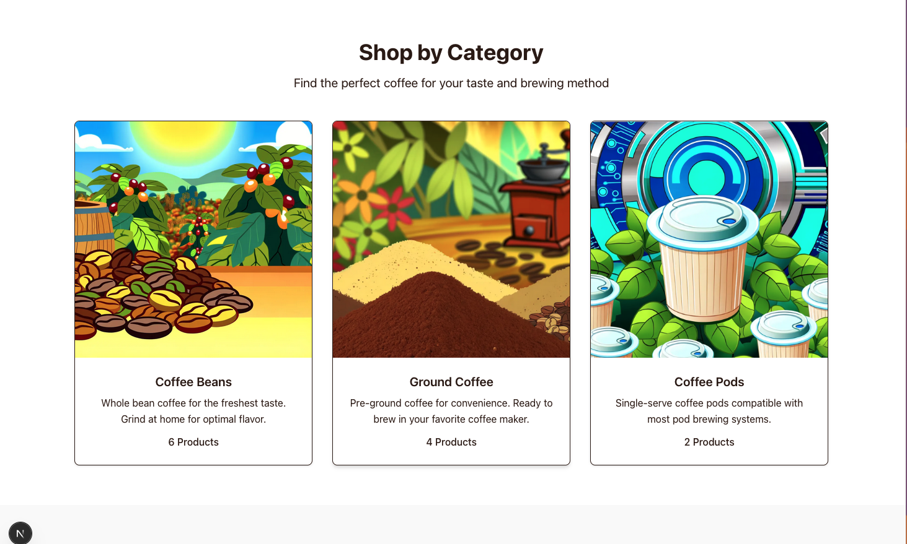
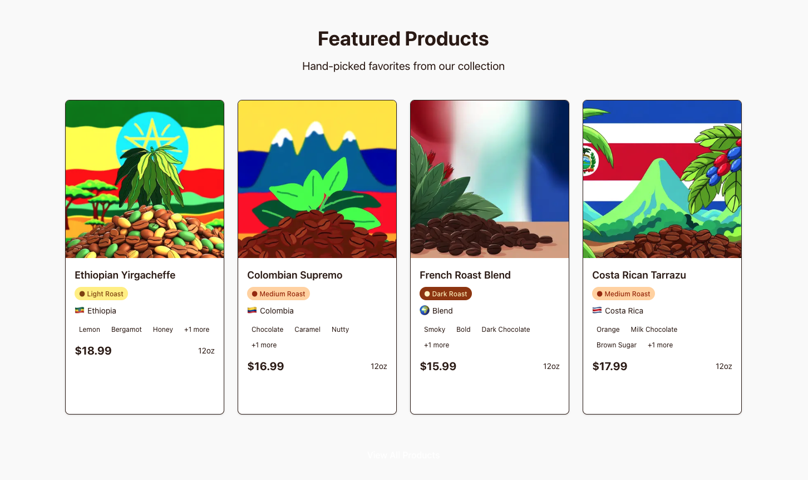
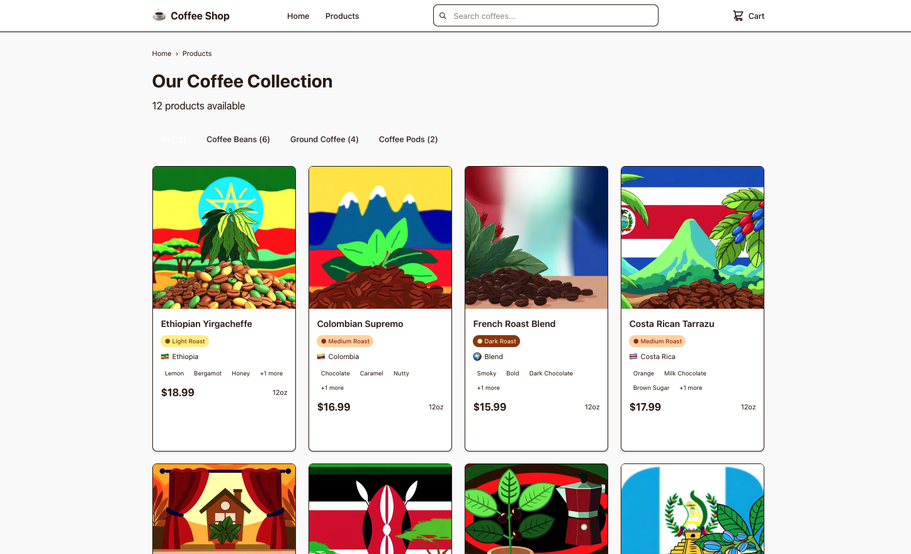

# Coffee Shop Online Store - Built with Claude Code

> **A complete full-stack e-commerce application built in under 2 hours using Claude Code's specialized sub-agents, demonstrating the power of AI-assisted development with carefully crafted prompts and context management.**

## 🤖 Built 100% with Claude Code Sub-Agents

This entire application was developed using Claude Code's specialized agent system, showcasing how AI can rapidly build complex, production-ready applications when given proper context and structured prompts.

> **Learn More**: [Claude Code Sub-Agents Documentation](https://docs.anthropic.com/en/docs/claude-code/sub-agents)

### Agent Orchestration Used

1. **🏗️ system-architect** - Designed the complete system architecture, API specifications, and technical stack decisions
2. **🎨 ui-designer** - Created comprehensive ASCII wireframes and design system specifications  
3. **🐍 python-backend-dev** - Implemented the entire FastAPI backend with session management and data handling
4. **⚛️ react-typescript-specialist** - Built the complete Next.js frontend with TypeScript and responsive design

### Development Timeline: **< 2 Hours**

- **Planning & Architecture** (30 minutes): System design, API specification, UI wireframes
- **Backend Implementation** (45 minutes): FastAPI server, data models, cart management, testing
- **Frontend Implementation** (45 minutes): Next.js app, components, state management, styling
- **Integration & Testing** (15 minutes): End-to-end testing, bug fixes, documentation

## 🏪 What Was Built

A complete coffee shop e-commerce platform featuring:

- **Product Catalog**: 12 premium coffee products across 3 categories
- **Shopping Cart**: Session-based cart with add/update/remove functionality
- **Responsive Design**: Mobile-first approach with desktop optimization
- **Complete User Flow**: Browse → Product Details → Add to Cart → Checkout

## 🚀 Quick Start

### Prerequisites
- Node.js 18+ and npm
- Python 3.8+ and pip

### 1. Start the Backend (FastAPI)

```bash
# Navigate to backend directory
cd backend

# Create and activate virtual environment
python3 -m venv venv
source venv/bin/activate  # On Windows: venv\Scripts\activate

# Install dependencies
pip install -r requirements.txt

# Start the server
python main.py
```

**Backend will be running at**: http://localhost:8000
- API endpoints: http://localhost:8000/api
- Interactive docs: http://localhost:8000/docs

### 2. Start the Frontend (Next.js)

```bash
# Navigate to frontend directory  
cd frontend

# Install dependencies
npm install

# Start development server
npm run dev
```

**Frontend will be running at**: http://localhost:3000

### 3. Test End-to-End

```bash
# Install test dependencies (if needed)
pip3 install requests

# Run comprehensive test suite
python3 test_e2e.py
```

## 🎯 Key Features Demonstrated

### Backend (FastAPI)
- **RESTful API Design**: Products, cart, and order endpoints
- **Session Management**: HTTP-only cookies for cart persistence  
- **Data Modeling**: Pydantic models with comprehensive validation
- **JSON Data Source**: Serving 12 coffee products from static files
- **CORS Configuration**: Proper frontend-backend communication
- **Comprehensive Testing**: All endpoints tested and validated

### Frontend (Next.js 15 + TypeScript)
- **Modern React Patterns**: App Router, Server Components, Context API
- **Type Safety**: Complete TypeScript coverage with custom interfaces
- **Responsive Design**: Mobile-first with Tailwind CSS custom theme
- **State Management**: React Context for global cart state
- **Error Handling**: Loading states, error boundaries, form validation
- **Performance**: Optimized API calls and efficient re-renders

## 🧠 Claude Code Techniques Demonstrated

### 1. **Strategic Agent Selection**
Each sub-agent was chosen for their specialized expertise:
- System architect for technical decisions and API design
- UI designer for wireframes and user experience flow
- Backend specialist for Python/FastAPI implementation  
- Frontend specialist for React/TypeScript development

### 2. **Context Management**
- **Shared Context**: API specification and wireframes used across agents
- **Reference Files**: Sample data and PRD provided as context
- **Sequential Building**: Each agent built upon previous agent's work

### 3. **Prompt Engineering**
- **Specific Requirements**: Clear MVP scope and technical constraints
- **Output Specifications**: Exact file structures and implementation patterns
- **Integration Points**: Clear interfaces between frontend and backend

### 4. **Parallel Development**
- Backend and frontend developed simultaneously by different agents
- Shared API contract ensured seamless integration
- End-to-end testing validated the complete system

## 📊 Technical Stack

### Backend
- **FastAPI** - Modern Python web framework
- **Pydantic** - Data validation and serialization
- **Uvicorn** - ASGI server for development
- **Session Management** - HTTP-only cookies
- **JSON Data Store** - File-based product catalog

### Frontend  
- **Next.js 15** - React framework with App Router
- **TypeScript** - Type safety throughout
- **Tailwind CSS** - Utility-first styling with custom theme
- **React Context** - Global state management
- **Responsive Design** - Mobile-first approach

## 🎨 Design Philosophy

### Coffee Shop Aesthetic
- **Warm Color Palette**: Coffee browns, creams, and gold accents
- **Typography**: Clean, readable Inter font family
- **Visual Hierarchy**: Clear product presentation and navigation
- **Touch-Friendly**: Optimized for mobile interactions

### User Experience
- **Intuitive Navigation**: Clear product discovery flow
- **Instant Feedback**: Real-time cart updates and loading states
- **Error Prevention**: Form validation and user guidance
- **Accessibility**: Proper ARIA labels and keyboard navigation

## 📁 Project Structure

```
coffee-shop/
├── backend/                   # FastAPI backend server
│   ├── main.py               # Complete API implementation
│   ├── requirements.txt      # Python dependencies
│   └── data/                 # JSON product data
├── frontend/                 # Next.js frontend application
│   ├── src/
│   │   ├── app/             # Next.js 15 App Router pages
│   │   ├── components/      # Reusable UI components
│   │   ├── contexts/        # React Context providers
│   │   ├── lib/            # API client and utilities
│   │   └── types/          # TypeScript definitions
│   ├── package.json
│   └── tailwind.config.js   # Custom theme configuration
├── docs/                    # Sample data and specifications
├── api-specification.md     # Complete API documentation
├── ui-wireframes.md        # ASCII wireframes and design
└── test_e2e.py            # End-to-end test suite
```

## 🧪 Quality Assurance

### Comprehensive Testing
- **Backend API Testing**: All endpoints validated with proper responses
- **Frontend Integration**: Cart operations and user flows tested
- **End-to-End Validation**: Complete user journey from browse to checkout
- **Error Handling**: Network failures and edge cases covered

### Code Quality
- **TypeScript**: Full type safety with no `any` types
- **Error Boundaries**: Graceful failure handling
- **Loading States**: Proper user feedback during operations  
- **Validation**: Form inputs and API responses validated

## 🎓 Learning Outcomes

This project demonstrates several key principles of AI-assisted development:

### 1. **Agent Specialization Works**
Each Claude Code sub-agent excelled in their domain, producing higher quality code than a generalist approach.

### 2. **Context is Critical**  
Providing comprehensive context (PRD, wireframes, API specs) enabled agents to make informed decisions and maintain consistency.

### 3. **Structured Prompts Accelerate Development**
Clear requirements, constraints, and expected outputs led to precise implementations with minimal iteration.

### 4. **Integration Planning Prevents Issues**
Defining interfaces upfront (API contracts, data models) enabled parallel development without integration problems.

### 5. **Testing Validates AI Output**
Automated end-to-end tests provided confidence that AI-generated code works correctly in real scenarios.

## 🚀 Production Readiness

While built as an MVP in under 2 hours, this application includes production-quality features:

- **Scalable Architecture**: Clean separation between frontend and backend
- **Security**: Session-based authentication, input validation, CORS configuration
- **Performance**: Efficient data loading, optimistic updates, responsive design
- **Maintainability**: TypeScript types, modular components, clear documentation
- **Testing**: Comprehensive test coverage of critical user flows

## 🔮 Next Steps

This MVP foundation can be extended with:

- **User Authentication**: Login/signup with JWT tokens
- **Payment Processing**: Stripe or PayPal integration  
- **Inventory Management**: Real-time stock tracking
- **Admin Dashboard**: Product and order management
- **Email Notifications**: Order confirmations and shipping updates
- **Reviews & Ratings**: Customer feedback system

## 📸 Application Screenshots

### 🏠 Home Page

The home page showcases the coffee shop's beautiful storefront with a compelling hero section, category navigation, and featured products.


*Beautiful coffee shop storefront with compelling call-to-action*


*Browse by coffee type - beans, ground, and pods*


*Hand-picked favorites from our premium collection*

### 🛍️ Products Page

Browse our complete coffee catalog with filtering and detailed product information.


*Complete product catalog with category filtering and detailed coffee information*

## 💡 Key Takeaway

This project proves that with the right approach to AI-assisted development—specialized agents, careful context management, and structured prompts—complex applications can be built rapidly without sacrificing quality. The key is treating AI as a specialized team of experts rather than a single generalist tool.

---

**Built with ❤️ and ☕ using Claude Code in under 2 hours**# subagents-coffee
